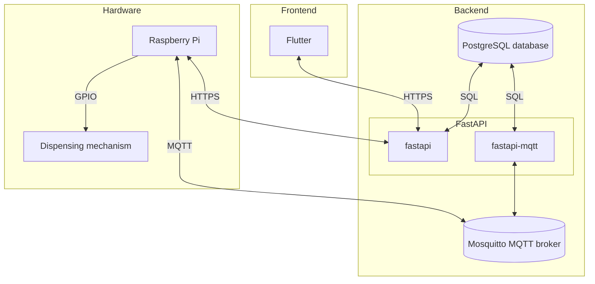

# HealthHubert
Tablet dispenser system made in cooperation with Technical University of Denmark

## DTU Courses involving development of HealthHubert
- 34315 IoT (Spring 2024):         Internet of things - application and infrastructure implementation
- Special course (Autumn 2024):    Rethinking medication management: Advanced design and usability of an IoT-integrated system 
- Special course (Spring 2025):    Forbedring af brugervenlighed i tablet dispenser design

## Authors
- Lars Dobrowohl
- Jacob Bonvang
- Juno Ngo
- Peter Bonvang
- Thomas Hegelund
- Vanda Nováková
